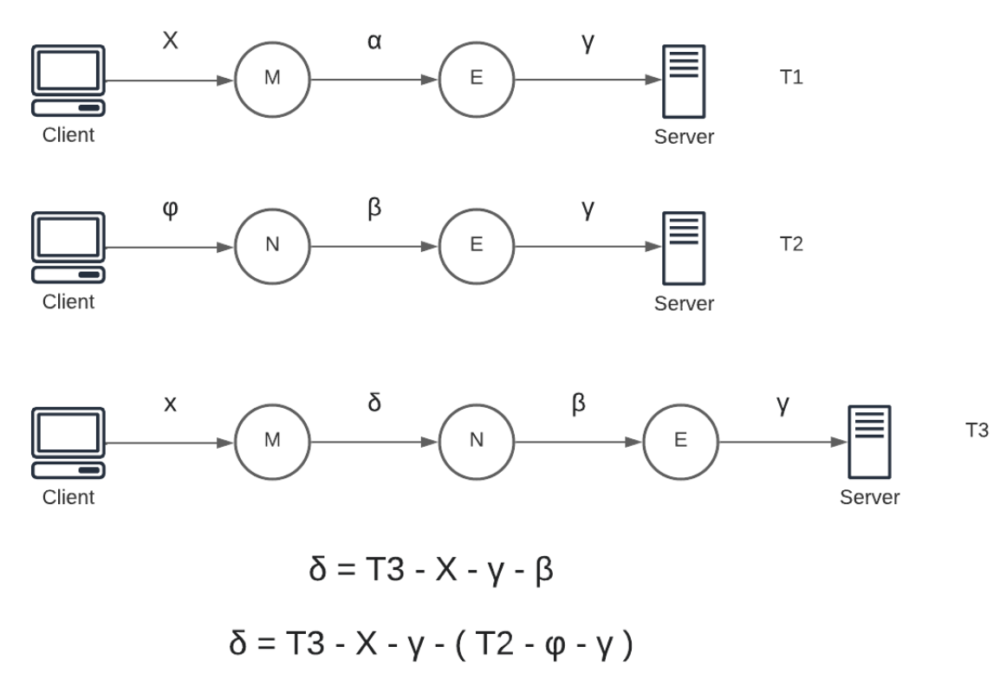

# Do you want to measure the latency between Tor's nodes?
You've come to the right place.

## Project made with Python 3.9.17, but scripts run under Docker's VM

# How to run it?

- `sudo docker build -t vm_tor .`
- `sudo docker run -v "$(pwd)/latency_output.csv:/latency_output.csv"  --network host  -it vm_tor /bin/bash`
- `./update_torrc.sh`
- `python automated_paths`

# How does the script work?

## Setting up docker
We want to have as much control as possible, therefore our best option is to create a VM with linux. In here we can customize the use of OpenSSL, pycurl, python, tor and debug with more freedom. As a reminder, this project run as for JUL/21/2023. Scripts, support and even Tor can change in the future, keep an open eye for it.

The image already contains everything we need and the "update_torrc" script automates the boot up of tor, so that we can are able to run "automated_paths" after a few seconds.

## Csv files explanation
- The file "input_file.csv" must have the fingerprints of the circuits you want to measure.

- The file "latency_ouput.csv" will be modified from the container and will be available from the host's side. This file contains a format similar to "input_file.csv", but at the end it contains the time elapsed. Keep in mind that if a circuit fails, the default value for the time will be -1.

- The file "nodes_list.csv" is supposed to have the format: Fingerpring,IP
And the file "ping_time_to_nodes.csv" will have the same data with one extra field, reffering to the time it took to ping.

## Python files explanation
- automated_paths.py: gets the time for every circuit provided in a CSV
- measure.py: updated file of Stem library to create custom circuits
- ping_to_nodes.py: measure the latency time between your device and each relay used.

## How do we measure latency?

To make a prediction, we need to control 2 things: the server and the client. In this way we can substract those times from the round trips and with the system of equations solve for our two variables. The main problem is that with a normal circuit with 3 nodes we can't know the latency between the Guard and Middle, but with this approach we can predict with fair accuracy such times.

## What is the project missing?
- Convert the script into a server, to redirect scripts to it's own IP. A first approach would be to a set a production mode with an end point that returns a text, so that 'Congratulations. This browser is configured to use Tor.' can be modified to another text.
- Create script that automates the process of calculating the latency between nodes after having the distance between the client/server to all of the Guard & Exit nodes, and the total time it elapsed for the petition to go trough the Tor network.
- If needed to, add to the Docker file pandas and pythonping, and copy the CSV files needed to ping the servers. In order to use Docker's VM environment to test.